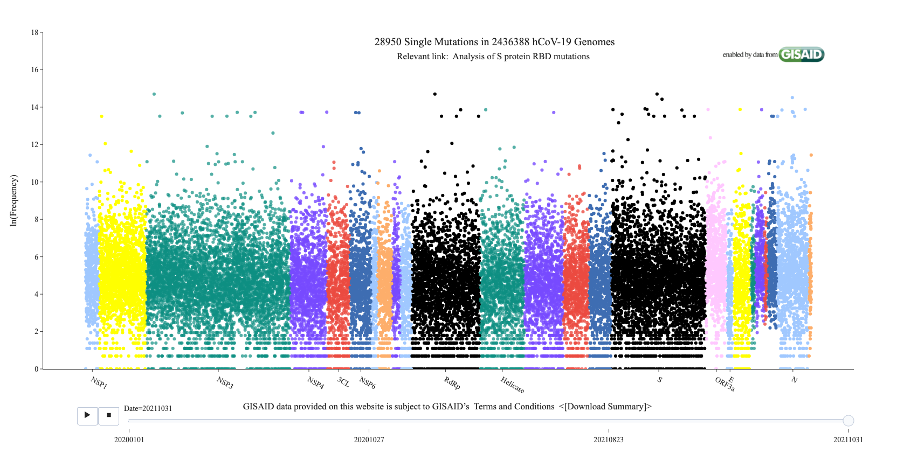

```{r, echo = FALSE, message = FALSE, warning = FALSE}
# Required packages
library(knitr, quietly = TRUE)
library(formatR, quietly = TRUE)
library(rticles, quietly = TRUE)
library(dplyr, quietly = TRUE)
library(reticulate, quietly = TRUE)
library(plotly, quietly = TRUE)
library(bookdown, quietly = TRUE)

# Wrap R code in final document
knitr::opts_chunk$set(cache = TRUE, echo = FALSE, message = FALSE, error = FALSE, fig.align="center", out.width="\\textwidth", tidy.opts=list(width.cutoff = 80), tidy = TRUE)
```

\hypersetup{urlcolor=blue}

# Background

The spread of coronavirus disease 2019 (COVID-19) continues to be of scientific and public health interest in the context of the ongoing global pandemic. Of particular concern is whether the underlying virus, severe acute respiratory syndrome coronavirus 2 (SARS-CoV-2), has become more infectious as a result of new mutations. 

A 2021 paper by Wang, R. *et al.* [@Wang2021] analyzed 45,494 complete SARS-CoV-2 genome sequences in order to analyze their mutations. Of the 12,754 sequences from the United States, the authors determined the presence of four substrains and eleven top mutations. Furthermore, the study concluded that two of these substrains had become more infectious given the mutations found on the spike protein.

We present a partial replication of the original study in order to validate its findings. A subset of the data used in the paper was processed in order to recreate selected figures (\autoref{fig:fig1}). Further analysis was also performed in order to summarize mutation characteristics for each protein across the entire SARS-CoV-2 genome. Finally, we discuss the implications of these findings on our current understanding of the SARS-CoV-2 viral makeup.

# Results

## Mutation Tracker

```{r fig1, fig.cap = "Screenshot of the mutation tracker website showing the distribution of mutations across the entire SARS-CoV-2 genome."}

```

```{r}
# Read latest mutation summary data into a combined data frame
# Data retrieved from https://users.math.msu.edu/users/weig/SARS-CoV-2_Mutation_Tracker.html
path <- "./data/MutationSummary_10312021/"
files <- dir(path)
mutation_summaries <- do.call(rbind, lapply(paste0(path, files), read.csv))

# Add column for raw nucleotide position
mutation_summaries <- mutation_summaries %>% mutate(position = as.integer(gsub("[^0-9]", "", mutation_site))) %>% arrange(position)

# Create new data frame to track the combined frequencies of each unique mutation
mutation_summaries_combined <- mutation_summaries %>% group_by(position) %>% summarise(frequency = sum(Total_frequency))

# Use nucleotide locations from https://www.ncbi.nlm.nih.gov/gene/ to clean data
# Protein name mapping adapted from original paper (Python code):
#
# def mapDict(self):
#   keys = ['[266:805]', '[806:2719]', '[2720:8554]', '[8555:10054]', '[10055:10972]', '[10973:11842]', '[11843:12091]', '[12092:12685]', '[12686:13024]', '[13025:13441]', '[13442:16236]',
#   '[16237:18039]', '[18040:19620]', '[19621:20658]', '[20659:21552]', '[13442:13480]', '[21563:25384]', '[25393:26220]', '[26245:26472]', '[26523:27191]', '[27202:27387]', '[27394:27759]', '[27756:27887]',
#   '[27894:28259]', '[28274:29533]', '29558:29674']
#   values = ['NSP1', 'NSP2', 'NSP3', 'NSP4', '3CL', 'NSP6', 'NSP7', 'NSP8', 'NSP9', 'NSP10', 'RdRp', 'Helicase', "Exonuclease", 'endoRNAse',
#   "2’-O-ribose MTases", 'NSP11','Spike', 'ORF3a', 'Envelope', 'Membrane', 'ORF6', 'ORF7a', 'ORF7b', 'ORF8', 'Nucleocapsid', 'ORF10']
#   nameMap = dict(zip(keys,values))
#   return nameMap
#
name_map <- rep("Others", 30000)
name_map[266:805] <- "NSP1"
name_map[806:2719] <- "NSP2"
name_map[2720:8554] <- "NSP3"
name_map[8555:10054] <- "NSP4"
name_map[10055:10972] <- "3CL"
name_map[10973:11842] <- "NSP6"
name_map[11843:12091] <- "NSP7"
name_map[12092:12685] <- "NSP8"
name_map[12686:13024] <- "NSP9"
name_map[13025:13441] <- "NSP10"
name_map[13442:16236] <- "RdRp"
name_map[16237:18039] <- "Helicase"
name_map[18040:19620] <- "Exonuclease"
name_map[19621:20658] <- "endoRNAse"
name_map[20659:21552] <- "2’-O-ribose MTases"
name_map[13442:13480] <- "NSP11"
name_map[21563:25384] <- "Spike"
name_map[25393:26220] <- "ORF3a"
name_map[26245:26472] <- "Envelope"
name_map[26523:27191] <- "Membrane"
name_map[27202:27387] <- "ORF6"
name_map[27394:27759] <- "ORF7a"
name_map[27756:27887] <- "ORF7b"
name_map[27894:28259] <- "ORF8"
name_map[28274:29533] <- "Nucleocapsid"
name_map[29558:29674] <- "ORF10"
mutation_summaries_combined$protein <- name_map[mutation_summaries_combined$position]

# Remove rows with default protein name
mutation_summaries_combined <- subset(mutation_summaries_combined, protein != "Others")
```

```{r}
# Color values adapted from settings used in original paper (Python code):
#
# color_continuous_scale=[
#   "rgb(160,200,255)","yellow","rgba(13,143,129,0.7)", "rgba(119,74,1750,0.8)", "rgba(235,74,64,0.8)","rgb(62,109,178)", "rgb(160,200,255)", "rgb(253,174,107)", "rgba(119,74,1750,0.8)",
#   "rgb(160,200,255)","black","rgba(13,143,129,0.7)", "rgba(119,74,1750,0.8)", "rgba(235,74,64,0.8)","rgb(62,109,178)", "rgb(160,200,255)", "black", "rgb(260,200,255)",
#   "rgb(160,200,255)","yellow","rgba(13,143,129,0.7)", "rgba(119,74,1750,0.8)", "rgba(235,74,64,0.8)","rgb(62,109,178)", "rgb(160,200,255)", "rgb(253,174,107)"])
#
scatter_palette <- c("#a0c8ff","yellow","#0d8f81", "#774ad6", "#eb4a40","#3e6db2", "#a0c8ff", "#fdae6b", "#774ad6", "#a0c8ff","black","#0d8f81", "#774ad6", "#eb4a40","#3e6db2", "#a0c8ff", "black", "#04c8ff", "#a0c8ff","yellow","#0d8f81", "#774ad6", "#eb4a40","#3e6db2", "#a0c8ff", "#fdae6b")

# Create scatter plot of mutations
scatter_fig <- plot_ly(data = mutation_summaries_combined, 
                       x = ~position, 
                       y = ~log(frequency), 
                       type = "scatter", 
                       mode = "markers", 
                       color = ~protein, 
                       colors = scatter_palette)
scatter_fig <- scatter_fig %>% 
  layout(title = "Mutation distribution across the SARS-CoV-2 genome", 
         xaxis = list(title = "", 
                      showgrid = FALSE, 
                      tickangle = 60, 
                      tickmode = "array", 
                      nticks = 11, 
                      tickvals = c(536, 5638, 9305, 10514, 11408, 14839, 17138, 23474, 25807, 26359, 28904), 
                      ticktext = c("NSP1", "NSP3", "NSP4", "3CL", "NSP6", "RdRp", "Helicase", "S", "ORF3a", "E", "N")), 
         yaxis = list(title = "ln(Frequency)", 
                      showgrid = FALSE), 
         font = list(family = "Serif", 
                     size = 32, 
                     color = "black"), 
         showlegend = FALSE, 
         margin = list(t = 200))
save_image(scatter_fig, "./figures/updated_distribution.pdf", width = 2304, height = 1152)
```

```{r fig2, fig.cap = "Genome-wide SARS-CoV-2 mutation distribution as of 31 October 2021. As in the original distribution figure, the natural log frequency of mutations on specific nucleotide positions is plotted on the $y$-axis. The positions of certain landmark proteins are also annotated on the $x$-axis. (author W.S.)"}
knitr::include_graphics("./figures/updated_distribution.pdf")
```

As part of the original study [@Wang2021], a website called [Mutation Tracker](https://users.math.msu.edu/users/weig/SARS-CoV-2_Mutation_Tracker.html) was created to report the distribution of unique single mutations across the entire SARS-CoV-2 genome. A screen shot of this tracker is included in the paper's [@Wang2021] supplementary information (Figure S1, included as \autoref{fig:fig1} in this report). We downloaded the summary data provided from the website, itself generated by Wang, R. *et al.* using sequence data from GISAID ([https://www.gisaid.org/](https://www.gisaid.org/)). The summary data is updated automatically by the mutation website, with the totals from 31 October 2021 being used in this paper. Split among 26 different files for each named protein, the summary data was reprocessed into a single data frame representing the whole viral genome.

As \autoref{fig:fig2} shows, we replicated the original distribution graph using this updated data. It is evident that NSP3 and the spike protein are both among the largest proteins and have experienced a high frequency of unique mutations across their domains. We also observe that ORF7a, ORF7b, and ORF8 all have relatively high mutation frequencies, in spite of their short length.

## Mutation Summary Statistics

```{r}
# Generate mutation statistics by protein
aggregate_summaries <- mutation_summaries_combined %>% 
  group_by(protein) %>% 
  summarise(total_mutations = sum(frequency)) %>% 
  mutate(raw_percent = (total_mutations / sum(total_mutations)) * 100, 
         nucleotide_length = sapply(protein, switch, 
                                    "NSP1" = {805-266}, 
                                    "NSP2" = {2719-806}, 
                                    "NSP3" = {8554-2720}, 
                                    "NSP4" = {10054-8555}, 
                                    "3CL" = {10972-10055}, 
                                    "NSP6" = {11842-10973}, 
                                    "NSP7" = {12091-11843},
                                    "NSP8" = {12685-12092},
                                    "NSP9" = {13024-12686},
                                    "NSP10" = {13441-13025},
                                    "RdRp" = {16236-13442},
                                    "Helicase" = {18039-16237},
                                    "Exonuclease" = {19620-18040},
                                    "endoRNAse" = {20658-19621},
                                    "2’-O-ribose MTases" = {21552-20659},
                                    "NSP11" = {13480-13442},
                                    "Spike" = {25384-21563},
                                    "ORF3a" = {26220-25393},
                                    "Envelope" = {26472-26245},
                                    "Membrane" = {27191-26523},
                                    "ORF6" = {27387-27202},
                                    "ORF7a" = {27759-27394},
                                    "ORF7b" = {27887-27756},
                                    "ORF8" = {28259-27894},
                                    "Nucleocapsid" = {29533-28274}, 
                                    "ORF10" = {29674-29558}
                                    ), 
         mutations_per_nucleotide = total_mutations / nucleotide_length) %>% 
  arrange(desc(total_mutations))
```

```{r tab1}
knitr::kable(aggregate_summaries, format = "latex", booktabs = TRUE, digits = 3, col.names = c("protein", "total mutations", "% total mutations", "protein length", "mutations/nucleotide"), caption = "Summary statistics for each SARS-CoV-2 protein (author W.S.)", format.args = list(big.mark = ","))
```

To quantify our interpretations, we computed further statistics to summarize the mutation distribution. \autoref{tab:tab1} lists this data for each protein ordered by total mutation frequency. The spike protein, NSP3, and the nucleocapsid are the top three proteins, with their respective frequencies (17,134,885, 12,191,479, and 11,760,145 mutations) being a full order of magnitude greater than the rest. Interestingly, we note that ORF8, ORF7a, and NSP6 have an unusually high number of mutations with respect to their length. This corroborates our previous observations of the mutation distribution graph provided by \autoref{fig:fig2}.

## Mutation Percentage Comparison

```{r}
# Read mutation summary data for 10202021
path <- "./data/MutationSummary_10202021/"
files <- dir(path)
mutation_summaries_10202021 <- do.call(rbind, lapply(paste0(path, files), read.csv))

# Find percent mutations by protein for 10202021
bar_data_10202021 <- mutation_summaries_10202021 %>% 
  mutate(position = as.integer(gsub("[^0-9]", "", mutation_site))) %>% 
  group_by(position) %>% 
  summarise(frequency = sum(Total_frequency))
bar_data_10202021$protein <- name_map[bar_data_10202021$position]
bar_data_10202021 <- subset(bar_data_10202021, protein != "Others")
bar_data_10202021 <- bar_data_10202021 %>% 
  group_by(protein) %>%
  summarise(total_mutations = sum(frequency)) %>%
  mutate(raw_percent = (total_mutations / sum(total_mutations)) * 100) %>%
  arrange(desc(total_mutations)) %>% 
  select(protein, raw_percent) %>% 
  head(7)
others <- list("Others", 100 - sum(bar_data_10202021$raw_percent))
bar_data_10202021 <- bar_data_10202021 %>% 
  rbind(others) %>%
  arrange(raw_percent) %>% 
  mutate(date = "10202021")

# Find percent mutations by protein for latest data (10312021)
bar_data_10312021 <- aggregate_summaries %>% 
  select(protein, raw_percent) %>% 
  head(7)
others <- list("Others", 100 - sum(bar_data_10312021$raw_percent))
bar_data_10312021 <- bar_data_10312021 %>% 
  rbind(others) %>%
  arrange(raw_percent) %>% 
  mutate(date = "10312021")

# Combine data into single data frame for plotting
bar_data <- rbind(bar_data_10202021, bar_data_10312021)

# Created stacked bar chart for each date ordered by percent
stacked_bar <- ggplot(bar_data, aes(x = date, y = raw_percent, group = raw_percent)) +
  geom_col(aes(fill = protein), width = 0.9) +
  scale_fill_brewer(type = "qual", palette = "Paired") +
  geom_text(aes(label = paste0(protein, " - ", round(raw_percent, digits = 1), "%")), position = position_stack(vjust = 0.5)) + 
  ggtitle("Percentage of total mutations by protein") + 
  xlab("Date") + 
  ylab("Percent") + 
  labs(fill = "Protein") +
  theme_classic(base_family = "serif") + 
  theme(plot.title = element_text(hjust = 0.5))
ggsave("./figures/stacked_bar.pdf")
```

```{r fig3, fig.cap = "Comparison of total mutation percentages for two collected dates (listed in \\texttt{MMDDYYYY} format). For each bar, only the 7 proteins with the largest percentages are named. (author W.S.)"}
knitr::include_graphics("./figures/stacked_bar.pdf")
```

From our summary statistics, we generated a graphical breakdown of the total mutation percentage. \autoref{fig:fig3} displays this data for the top 7 proteins between 20 October 2021 and 31 October 2021. Following from our analysis of the summary statistics, the spike protein made up roughly 24\% of the total recorded mutation frequency. The graph changes little between the 10 days comprising each time point. Of note is that a full 13 proteins make up less than 1\% each of the total.

# Discussion

Our analysis successfully replicated the original plot of the mutation distribution represented by \autoref{fig:fig1}. Our version, \autoref{fig:fig2}, makes use of the updated data provided from the Mutation Tracker website and recapitulates the features observed there. Along with the summary statistics from \autoref{tab:tab1}, we corroborated the significance of the spike protein in the current pattern of SARS-CoV-2 mutation.

Our approach is limited by the scope of the data used in the study. The Mutation Tracker website only allows downloading summary data from the most recent time point. While we had preserved an earlier archive from 20 October 2021, a more thorough comparison than that seen in \autoref{fig:fig3} would use a greater range of dates. Further study into the change in mutation over time, either by sampling the tracker or by directly processing the source data from GISAID, could provide more insight.

The summary statistics from \autoref{tab:tab1} suggest differences in mutation characteristics between the 26 studied proteins. Given our observation of relatively more mutations in shorter proteins, a conformational analysis could further assess the influence of a protein's size and 3D structure on the number of mutations it experiences. 

There is also interest in determining the extent, if any, of evolutionary pressure on mutation rate. Some of the proteins comprising the lowest percentages of the total mutation frequency, such as NSP11 and the envelope protein, are known to have important roles in the viral life cycle [@Zhang2016; @Schoeman2019]. Future work could determine if proteins with functions in viral replication versus internal regulation experience more mutations.

# Conclusion

In this paper, we presented a partial replication of an earlier study by Wang, R. *et al.*[@Wang2021]. We recapitulated their visualization of the genome-wide SARS-CoV-2 mutation distribution. We further analyzed the underlying data in order to summarize the influence of each protein on the overall mutation frequencies. The current global pandemic remains one of the most significant challenges to public health in recent memory. In light of emerging variants of SARS-CoV-2, it is even more important to understand how and where the virus mutates.

# Methods

## Data Collection and Preprocessing

The original paper [@Wang2021] used 45,494 complete genome sequences of SARS-CoV-2 strains from infected invdividuals. These sequences were sourced from the GISAID ([https://www.gisaid.org/](https://www.gisaid.org/)) database up to 11 September 2020. For this analysis, we used the 31 October 2021 summary data from the [Mutation Tracker](https://users.math.msu.edu/users/weig/SARS-CoV-2_Mutation_Tracker.html) website. The tracker is continually updated with the latest data from GISAID.

Data preprocessing was accomplished using R [@R-base] and the dplyr [@R-dplyr] package. The 26 \texttt{.csv} files for each named protein were parsed and combined into a single data frame in order of position on the SARS-CoV-2 genome. Mutation frequencies were mapped to the corresponding protein name using nucleotide positions sourced from the NIH ([https://www.ncbi.nlm.nih.gov/gene/](https://www.ncbi.nlm.nih.gov/gene/)).

## Plots and Figures

The plot of the genome-wide SARS-CoV-2 mutation distribution (\autoref{fig:fig2}) was generated using the Plotly package for R [@R-plotly]. The stacked bar chart comparing per-protein mutation percentages (\autoref{fig:fig3}) was generated using the ggplot2 package [@R-ggplot2] using the same data as the mutation distribution plot (summarized for each protein).

# Declarations {-}

## Data and Code Availability {-}

This paper uses the summary data from the [Mutation Tracker](https://users.math.msu.edu/users/weig/SARS-CoV-2_Mutation_Tracker.html) website up to 31 October 2021. This data was originally sourced from GISAID ([https://www.gisaid.org/](https://www.gisaid.org/)).

All code for this paper is attached in the appendix and is also available on the author's (W.S.) GitHub at [https://github.com/thisstillwill/QCB455-Fall-2021](https://github.com/thisstillwill/QCB455-Fall-2021).

## Acknowledgements {-}

The authors are grateful to Rui Wang and Guo-Wei Wei for their correspondance providing the color values used in the Mutation Tracker and describing the approach used to clean the summary data.

## Author Contributions {-}

W.S. downloaded and preprocessed the summary data from the Mutation Tracker website. W.S. plotted the mutation frequencies from the summary data to replicate Figure S1 from the original paper. W.S. conducted further analysis of the dataset to summarize the mutation data for each protein.

B.M. downloaded and translated reference genomes for related coronaviruses into individual proteins. B.M. conducted multiple sequence alignment for each protein and calculated percent similarity in order to replicate Figures S5, S7, S8, S10, and S13. Additionally, B.M. added a table summarizing substitution mutation frequencies.

S.S. conducted multiple sequence alignment and single-nucleotide polymorphism (SNP) calling on the complete genome sequences to create SNP profiles for each genome, and used a Jaccard distance-based representation of the SNP variants as input features into a K-means clustering algorithm. S.S. plotted the distributions of the resulting clusters on a U.S. map to replicate Figure 1 from the original paper.

All authors have read and agreed to the published version of the manuscript.

## Competing Interests {-}

The authors declare no competing interests.

# References {-}

```{r}
# Cite packages
knitr::write_bib(c(.packages(), "bookdown"), "packages.bib")
```

<div id="refs"></div>

\appendix

# All Code

```{r ref.label=knitr::all_labels(), echo = TRUE, eval = FALSE}
```

# Session Info

```{r}
sessionInfo(package = NULL)
```
